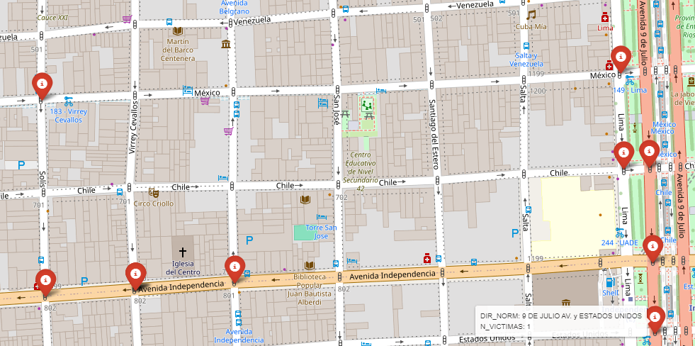
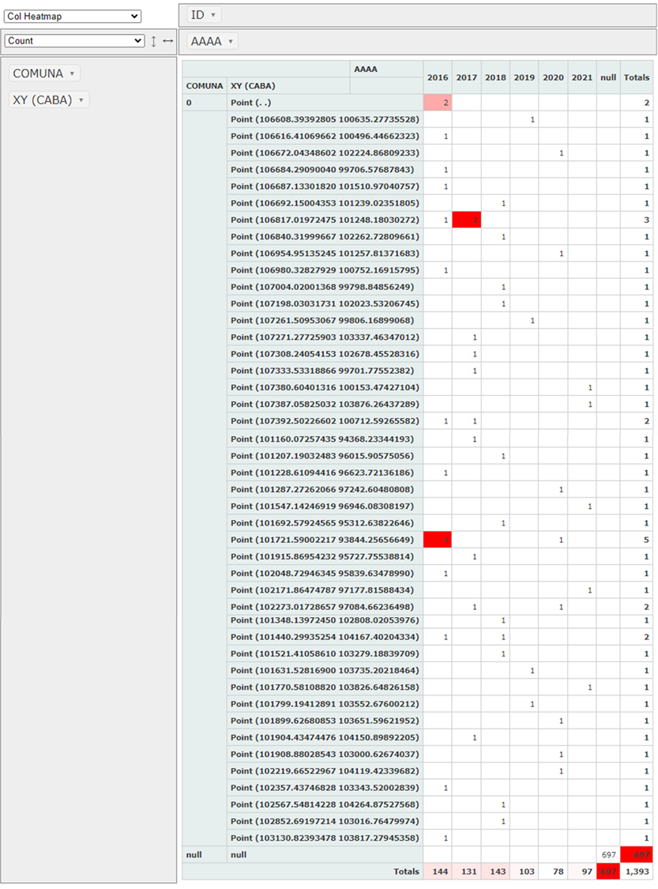
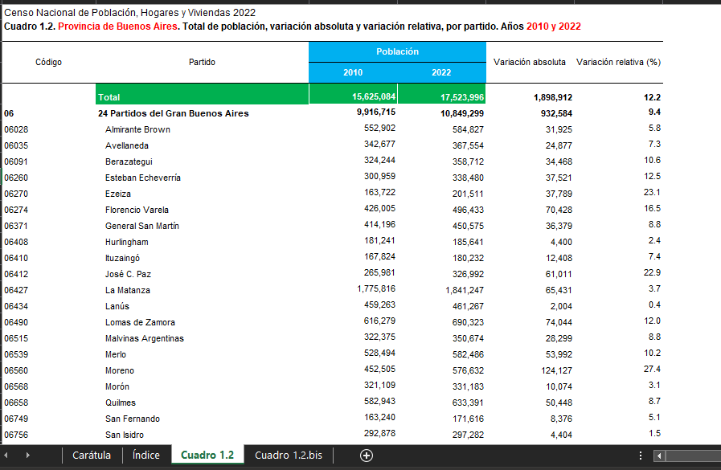

<h1 align='center'>
 <b>PROYECTO INDIVIDUAL Nº2</b>
</h1>
 
# <h1 align="center">**`Siniestros viales`**</h1>

## **Desarrollo del analisis de Dataset**

Como primera tarea para familiarizarme con el dataset de que nos comparte la agencia:

- [Buenos Aires Data](https://data.buenosaires.gob.ar/dataset/victimas-siniestros-viales): en el archivo de `Homicidios`

Construí un mapa mediante la libreria folium, sobre la demarcacion CABA para enteder su distribucion geografica:

en la cual concluyo que, los choques se dan en las intersecciones y que es muy dificil determinar la periodicidad de los eventos mediante un mapa con punteros de coordenadas, por lo decido que con un filtro puedo construir una tabla dinamica para observar lo siguiente:

En resumen el registro de los accidentes viales muestra datos insuficientes de repetitividad, ya que los 717 casos documentados en su mayoria se repiten 1 vez para cada interseccion; durante seis años de registros que contempla el dataset, son observables algunas salvedades en las que se presentan dos acidentes, siendo cuatro el numero mayor de choques que se presentan en una misma interseccion o coordenada. 

 Otro problema que se presentan en las dos hojas llamadas: hechos y víctimas, es que a pesar de que la construcción del dataset representa una labor incomiable y titanica no presenta datos significativos tales como; el motivo o causa de origen del siniestro, pruebas de alcolemia o si fue una falla mecanica; teniendo en cuenta los siguientes puntos para la elaboracion de su clasifcador:

### **Contexto**

El origen de un siniestro, también conocido como causa o factor causal, es el elemento determinante que desencadena el evento. Tanto la policía como los ajustadores de seguros se encargan de registrarlo para fincar responsabilidades.

Para comprender mejor las causas de un siniestro, y poder construir un clasificador es importante analizar las condiciones del conductor y del vehículo, así como las características del entorno:

1. Condiciones del conductor:

Estado de ebriedad: Conducir bajo la influencia del alcohol o drogas altera la capacidad de reacción y juicio, aumentando el riesgo de accidentes.
Fatiga por sueño: La falta de sueño reduce la atención y los reflejos, lo que puede provocar errores al volante.
Condiciones óptimas: Si el conductor no se encontraba bajo la influencia de sustancias ni padecía fatiga, se analizará si realizó alguna maniobra prohibida que contribuyera al accidente.

2. Condiciones del vehículo:

Falla mecánica: Un fallo en los frenos, la dirección o cualquier otro componente del vehículo puede ser la causa del siniestro.
Cargas inadecuadas: El exceso de peso o la mala distribución de la carga pueden afectar la estabilidad del vehículo.
Mantenimiento deficiente: La falta de mantenimiento adecuado puede aumentar el riesgo de averías y accidentes.

3. Características del entorno:

Obstáculos o baches: La presencia de obstáculos en la vía o desperfectos en el pavimento pueden ser causa de un accidente.
Falta de señalización: La ausencia de señales de tráfico o su mal estado puede generar confusión en los conductores.
Condiciones climáticas adversas: La lluvia o el granizo pueden reducir la visibilidad y dificultar la conducción.

4. Imprevistos:

Falta de preferencia: Si un conductor no respeta el derecho de paso de otro vehículo o peatón, puede provocar un accidente.
Aparición repentina de objetos o personas: La presencia inesperada de un animal, un objeto o una persona en la calzada puede ser inevitable para el conductor.

Al  combinar las dos tablas no encontre una columna que me indique la causa del accidente, lo que es absurdo ya que los funcionarios del servicio publico se tomaron la iniciativa de registrar la fecha del accidente y la fecha del fallecimiento de los involcrados, esta acción significa que se realizo un seguimiento, pero no registraron la causa oficial del siniestro, lo cual permitiría encontrar un correlacion entre el tipo de siniestro y sus causas raiz, lo que daria luz sobre que estrategias o politicas publicas serián mas adhoc al tipo evento que se ha registrado.

En el dataset se observan errores de factor humano, pero el mas grave es el **error de diseño**  de la mega tabla de resgitros; por que en ninguna de las dos hojas se les ocurrio simplemente, tomar en consideración el llevar un registro del parte oficial obtenido por el peritaje policiaco o de la consigna de los ajustadores de seguros.

### **Que se puede hacer para construir los KPI**

Segun el Instituto Nacional de Estadística y Censos de la República Argentina (INDEC); se ajustó la cifra total de habitantes respecto a la difundida en mayo de 2022: son en total 46.044.703 personas y el crecimiento fue del 14,8% en comparación con 2010; lo anterior es un problema por que los años que se tiene informacion va del 2016 al 2021.

Para resolver el primer KPI se toma con base la siguiente información

    Población de la Ciudad Autónoma de Buenos Aires

| Año |    millones |
|---|---|
2016 | 2.890.151 |
2017 | 2.905.245 |
2018 | 2.920.339 |
2019 | 2.935.433 |
2020 | 2.950.527 |
2021 | 3.078.836 |

## **Mínimos entregables**
(Exploratory Data Analysis)
Realice un análisis exploratorio de los datos 
que se encuentra en [`EDA`](EDA.ipynb)

`Dashboard`
Los dos KPIs propuestos son:
- *Redución en un 10% la tasa de homicidios en siniestros viales de los últimos seis meses, en CABA, en comparación con la tasa de homicidios en siniestros viales del semestre anterior*.
  
  Definimos a la **tasa de homicidios en siniestros viales** como el número de víctimas fatales en accidentes de tránsito por cada 100,000 habitantes en un área geográfica durante un período de tiempo específico.
  Su fórmula es: (Número de homicidios en siniestros viales / Población total) * 100,000
  
- *Reducir en un 7% la cantidad de accidentes mortales de motociclistas en el último año, en CABA, respecto al año anterior*.
  
  Definimos a la **cantidad de accidentes mortales de motociclistas en siniestros viales** como el número absoluto de accidentes fatales en los que estuvieron involucradas víctimas que viajaban en moto en un determinado periodo temporal.
  Su fórmula para medir la evolución de los accidentes mortales con víctimas en moto es: (Número de accidentes mortales con víctimas en moto en el año anterior - Número de accidentes mortales con víctimas en moto en el año actual) / (Número de accidentes mortales con víctimas en moto en el año anterior) * 100

## **Conclusiones** 

El cerebro humano es considerado una de las máquinas más potentes e ingeniosas de nuestro mundo, pero fácilmente pierde la concentración y toma decisiones irracionales que no solo se autodestruyen, sino que afectan a quienes lo rodean. Por lo que no existe forma alguna de evitar los accidentes, pero por parte de la sociedad civil es posible exigir a nuestros gobiernos políticas públicas que ayuden a mitigarlos. Es nuestro deber como ciudadanos que nos valoramos a nosotros mismos y a nuestros semejantes tomar medidas para que los accidentes sean casos aislados o minimizar los daños colaterales o secuelas siguiendo las recomendaciones siguientes:

`Causas generales de los accidentes viales:`

Las causas de los accidentes viales son diversas. Entre las principales causas se encuentran:

Exceso de velocidad: El exceso de velocidad es una de las principales causas de accidentes viales.  

Conducción bajo la influencia del alcohol: Conducir bajo la influencia del alcohol es otra de las principales causas de accidentes viales.  

Distracciones al volante: Las distracciones al volante, como hablar por teléfono o enviar mensajes de texto, son también una causa importante de accidentes viales.  

Falta de infraestructura vial: La falta de infraestructura vial, como carreteras en mal estado o señalización deficiente, también es un factor que contribuye a los accidentes viales.

`Estrategias para disminuir los accidentes viales:`

Existen diversas estrategias que se pueden implementar para disminuir los accidentes viales. Entre las principales estrategias se encuentran:

Control del exceso de velocidad: Implementar medidas para controlar el exceso de velocidad, como multas más severas y mayor presencia de la policía de tránsito en las carreteras.

Prevención del consumo de alcohol al volante: Implementar medidas para prevenir el consumo de alcohol al volante, como campañas de concientización y controles de alcoholemia.

Prevención de las distracciones al volante: Implementar medidas para prevenir las distracciones al volante, como leyes que prohíban hablar por teléfono o enviar mensajes de texto mientras se conduce.

Mejora de la infraestructura vial: Invertir en la mejora de la infraestructura vial, como la construcción de carreteras más seguras y la mejora de la señalización

`Enfoque integral:`

Fortalecimiento de la educación vial: Implementar programas de educación vial en escuelas, universidades y para la población en general, con énfasis en la responsabilidad individual y el respeto por las normas de tránsito.

Mejora de la infraestructura vial: Invertir en la construcción y mantenimiento de carreteras seguras, con señalización adecuada, iluminación y barreras de contención.

Control y fiscalización: Implementar medidas para controlar el exceso de velocidad, la conducción bajo la influencia del alcohol o drogas, y otros comportamientos imprudentes al volante.

Promoción de la tecnología: Implementar sistemas de transporte inteligente, como radares de velocidad o sistemas de alerta de fatiga, para mejorar la seguridad vial.

Investigación y análisis: Fortalecer la investigación de las causas de los accidentes viales para desarrollar estrategias de prevención más efectivas.

Enfoque por actor:

Gobierno:
Implementar y hacer cumplir las leyes de tránsito.
Invertir en infraestructura vial segura.
Fortalecer la educación vial.
Implementar campañas de concienciación.

Conductores:
Respetar las normas de tránsito.
Conducir de forma responsable y segura.
No conducir bajo la influencia del alcohol o drogas.
Mantener el vehículo en buen estado.
Estar atento a las condiciones del entorno.

Pasajeros:
Exigir al conductor que respete las normas de tránsito.
Usar el cinturón de seguridad.
No distraer al conductor.

Empresas:
Implementar políticas de seguridad vial para sus empleados.
Capacitar a sus conductores en prácticas de conducción segura.
Mantener sus vehículos en buen estado.

  
  

